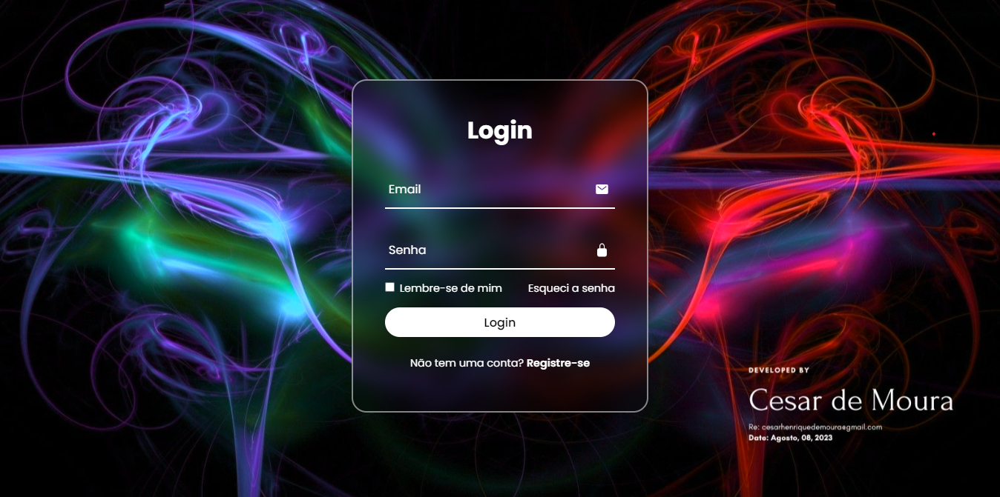
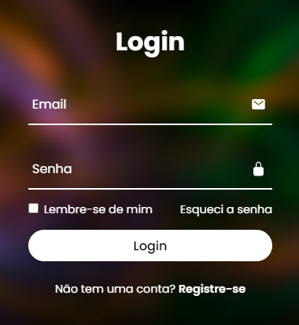

 Feito pelo <a href="https://www.linkedin.com/in/eucesarmoura/" > César de Moura </a> 
  

 21 de agosto de 2023 

 

## Tela de login responsiva

Projeto de estudo em *Front End*, o qual englobou o desenvolvimento de uma tela de login com efeitos visuais. O projeto teve as seguinte etapas:

<a href="https://eucesarmoura.github.io/GlassForm.io/" >Acesse aqui o projeto</a>

(1) Criação de base HTML.  
(2) Estruturação do stylesheet  
(3) Aplicação de efeito neon visual  

 
